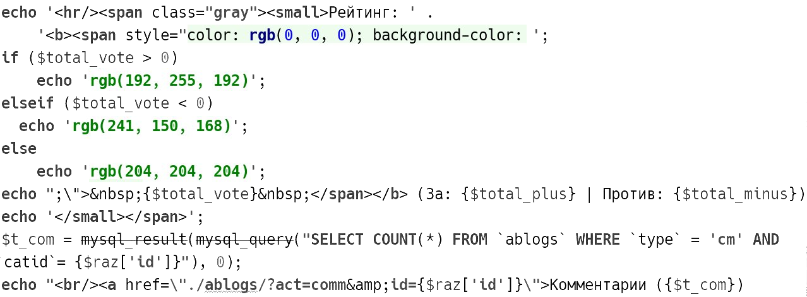
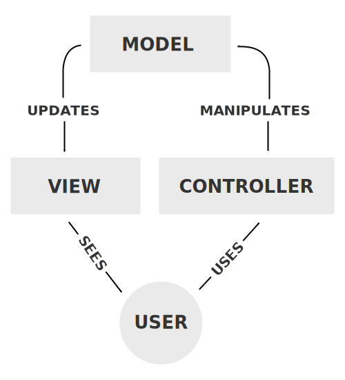

---

layout: bright

style: |
    .slide { background-color: white; }

    .slide pre code { line-height: inherit; margin: inherit; }

    .slide mark {
        background: 0 0;
    }

    a, .slide mark {
        color: #0080e0;
    }

    .slide b, .slide strong {
        font-weight: 700;
    }

    .slide h2 {
        margin: 0 0 58px;
        font: 48px/1 'Open Sans Light',sans-serif;
    }

    .slide h2 em {
        display: block;
        position: absolute;
        margin-top: -45px;
        font-size: 35px;
        font-style: normal;
        font-weight: 400;
        padding-bottom: 6px;
        color: #0080e0;
    }

    .slide.is-title.space {
        color: white;
        background-color: #112626;
        background-image: url('pictures/space_background.jpg');
    }
    .slide.is-title.space h2 {
        margin-top: 300px;
    }

    .slide.is-title.sky {
        background-image: url('pictures/sky_background.jpg');
        color: #F5FFE9;
    }

    .slide.is-title.mountains {
        color: white;
        background-color: #112626;
        background-image: url('pictures/title_background.jpg');
        opacity: 0.88;
    }

    .slide.is-title {
        background-size: cover;
    }

    .slide.is-title h2 strong {
        display: block;
        font-weight: 400;
        font-size: 350%;
        line-height: 1.35;
        position: relative;
        left: -7px;
    }

    .slide.is-title h2 {
        font-size: 32px;
    }

    [lang=en] .slide.is-title h2 strong {
        top: -5px;
        font-size: 380%;
        line-height: 1.3;
    }
    .slide.is-title h2 strong {
        display: block;
        font-weight: 400;
        font-size: 350%;
        line-height: 1.35;
        position: relative;
        left: -7px;
    }

    pre.low { line-height: 1.6 }

    mark.tag { color: #050074 }

    mark.property { color: #007F00 }

    mark.variable { color: #5F0002 }

---

# **MVC Pattern** который вы ждали всегда
{: .is-title.sky }

---

---

---

---

---

---

    <small>Рейтинг: <b>
        
            &nbsp;+7
        </b>
    &nbsp;(За: 11 | Против: –4)</small>
     <a href="?">Комментарии (48)</a>

## Что плохого?

* Трудно читать
* Нельзя тестировать
* Невозможно поддерживать
* Хочется плакать

## Что делать?
{:.shout}

---

~~~csharp
<mark>class</mark> StudentModel {

}
~~~
{: .low }

---

~~~csharp
<mark>class</mark> StudentModel {
    <mark>string</mark> Фио;

}
~~~
{: .low }

---

~~~csharp
<mark>class</mark> StudentModel {
    <mark>string</mark> Фио;
    <mark> int</mark>[] Оценочки;

}
~~~
{: .low }

---

~~~csharp
<mark>class</mark> StudentModel {
    <mark>string</mark> Фио;
    <mark> int</mark>[] Оценочки;

    <mark>public void</mark> AddMark(<mark>int</mark> mark)
        <mark>=></mark> Оценочки.Add(mark);

}
~~~
{: .low }

---

~~~csharp
<mark>class</mark> StudentModel {
    <mark>string</mark> Фио;
    <mark> int</mark>[] Оценочки;

    <mark>public void</mark> AddMark(<mark>int</mark> mark)
        <mark>=></mark> Оценочки.Add(mark);

    <mark>public void</mark> Отчислить()
        <mark>=></mark> if (Sum(Оценочки) < 60)
               Деканат.ОтчислитьСтудента(ФИО);
}
~~~
{: .low }

---

~~~csharp
<mark>class</mark> TeacherController {
    <mark>static void</mark> Action() {

    }
}
~~~
{: .low }

---

~~~csharp
<mark>class</mark> TeacherController {
    <mark>static void</mark> Action() {
        <mark>int</mark> rate = Console.ReadInteger(),
              id = Console.ReadInteger();

    }
}
~~~
{: .low }

---

~~~csharp
<mark>class</mark> TeacherController {
    <mark>static void</mark> Action() {
        <mark>int</mark> rate = Console.ReadInteger(),
              id = Console.ReadInteger();

        <mark>if</mark> (rate < <mark>0</mark>)
            Console.WriteLine(<mark>"Это не гуманно, чувак!"</mark>);

    }
}
~~~
{: .low }

---

~~~csharp
<mark>class</mark> TeacherController {
    <mark>static void</mark> Action() {
        <mark>int</mark> rate = Console.ReadInteger(),
              id = Console.ReadInteger();

        <mark>if</mark> (rate < <mark>0</mark>)
            Console.WriteLine(<mark>"Это не гуманно, чувак!"</mark>);

        <mark class="important">StudentModel</mark>.With(id).AddMark(rate);
    }
}
~~~
{: .low }

## Router

В зависимости от запроса вызывает нужный контроллер.
{: style="margin-top: -20px"}

~~~csharp
<mark>public static void</mark> Main(<mark>string</mark>[] args) {
    <mark>switch</mark> (Console.ReadLine()) {
        <mark>case</mark> "<mark class="comment">оценить</mark>":
            <mark class="important">TeacherController</mark>.Action(); <mark>break;</mark>
        <mark>case</mark> "<mark class="comment">насладиться</mark>":
            MarksController.Action(); <mark>break;</mark>
    }
}
~~~
{: .low.next style="margin-top: -10px" }

---

~~~csharp
<mark>class</mark> MarksController {
    <mark>static void</mark> Action() {
        id = Console.ReadInteger();
        student = StudentModel.With(id);
        <mark class="comment">RatesView.Print(student.Оценочки)</mark>;
    }
}
~~~
{: .low }
{: style="margin-top: -20px"}

---

~~~csharp
<mark>class</mark> MarksController {
    <mark>static void</mark> Action() {
        id = Console.ReadInteger();
        student = StudentModel.With(id);
        RatesView.Print(student.Оценочки);
    }
}

<mark>class</mark> RatesView {
    <mark>static void</mark> Print(оценочки)
        <mark>=></mark> Console.WriteLine(
            <mark>string</mark>.Join(<mark class="comment">", "</mark>, оценочки));
}
~~~
{: .low }
{: style="margin-top: -20px"}

## Ещё раз и кратко

* ​**Router** — выбирает нужный контроллер <mark class="next">| оценить и насладиться</mark>
* ​**Controller** — обрабатывает запрос <mark class="next">           | распихивает данные</mark>
* ​**Model** — данные и операции над ними <mark class="next">   | умеет в базу данных</mark>
* ​**View** — умеет выводить данные
* ...**<mark>???</mark>**
* ...**<mark>PROFIT</mark>**

## Разделяем код

* ...Модель для работы со статьями (рейтинг + комментарии)
* ...Контроллер будет определять цвет рейтинга (&nbsp;#F1A8A8 , &nbsp;#C0FFC0 )
* ...Вывод поместим во View (весь HTML и CSS там)

---

~~~php
<mark>class</mark> View {
  <mark>function</mark> display() {
    <mark>echo</mark> 'Рейтинг: $color</mark>">';
    <mark>echo</mark> '<mark>$rating</mark>';
    <mark>echo</mark> '';
    <mark>echo</mark> '(За: <mark>$positive</mark> | Против: <mark>$negative</mark>)';
    <mark>echo</mark> '<a href="/articles/?act=comments&id=<mark>$id</mark>">;
    <mark>echo</mark> 'Комментарии (<mark>$count</mark>)';
    <mark>echo</mark> '</a>';
  }
}
~~~
{: style="margin-top: -20px; margin-left: -15px"}

---

~~~php
<mark>class</mark> Article {
  <mark>function</mark> __construct($id) { <mark class="comment">\…</mark> }

  <mark>function</mark> getRating() {
    <mark>return</mark> sql(<mark class="comment">"SELECT `rate` FROM `article` WHERE id = <mark>$id</mark>"</mark>);
  }

  <mark>function</mark> countComments() {
    <mark>return</mark> sql(<mark class="comment">"COUNT (*) FROM `comments` WHERE id = <mark>$id</mark>"</mark>);
  }
}

~~~
{: style="margin-top: -20px; margin-left: -15px"}

---

~~~php
<mark>class</mark> Controller {
  <mark>function</mark> action() {
      $article = <mark>new</mark> Article($URL[<mark>'id'</mark>]);
       $rating = $article<mark>-></mark>getRating();
           $id = $article<mark>-></mark>id;

      $color = $rating > <mark>0</mark> ? <mark>'red'</mark> : <mark>'green'</mark>;
      View<mark>::</mark>display();
  }
}
~~~
{: style="margin-top: -20px; margin-left: -15px"}

---

~~~php
<mark class="comment">class Controller {
  function action() {
      $article = new Article($URL['id']);
       $rating = $article->getRating();
           $id = $article->id;</mark>

      $color = $rating > <mark>0</mark> ? <mark>'red'</mark> : <mark>'green'</mark>;
      <mark class="comment">View::display();
  }
}</mark>
~~~
{: style="margin-top: -20px; margin-left: -15px"}

## В чём проблема?

* Мы в смешали `View` с `Controller`
* Нужно лезть в `Controller`, чтобы изменить `Представление`
* Нарушили свою же концепцию ради разделения кода

~~~php
$color = $rating > <mark>0</mark> ? <mark>'red'</mark> : <mark>'green'</mark>;
<mark>echo</mark> 'Рейтинг: $color</mark>">';
~~~
{: .next }

## Чего добились?

* ...Переиспользование кода
* ...Можем тестировать компоненты отдельно
* ...Каждый разработчик занимается своим компонентом

## Изучено!
{:.shout}

## *Невинности нет* MVC был хотя бы раз у каждого!

Что ты делаешь, когда не знаешь, что делать? 
Гуглишь! 

## *Даже у Google!* MVC был хотя бы раз у каждого!

Controller <mark>→</mark> Models <mark>→</mark> View<mark class="important next">s</mark>

## *Даже у тебя ;)* MVC был хотя бы раз у каждого!

Вспоминаем первое задание, магазин.
{: .next }

* ...Обработчик команд — роутер
* ...Обработка конкретной команды — конкретный контроллер
* ...Библиотека классов магазина — модели
* ...View тривиальный — `<mark>Console</mark>.WriteLine()`

## *Даже у меня ;)* MVC был хотя бы раз у каждого!

Второе задание, калькулятор выражений, winforms

* ...Designer.cs — представление
* ...ClickEventListener — контроллер
* ...Formula — модель

## DeveloperRefusesToWorkException

< Хьюстон, у нас проблемы! 
> Что случилось, почему? 
< Наши верстальщики ненавидят PHP! 
> Ёлки-палки, и что мы будем делать? 
< Придумай что-нибудь, у тебя же есть <mark>чертоги разума</mark>! 
> ... 
> Кажется, нам нужен шаблонизатор 

---

~~~php
<mark>class</mark> View {
  <mark>function</mark> display() {
    <mark>echo</mark> 'Рейтинг: $color</mark>">';
    <mark>echo</mark> '<mark>$rating</mark>';
    <mark>echo</mark> '';
    <mark>echo</mark> '(За: <mark>$positive</mark> | Против: <mark>$negative</mark>)';
    <mark>echo</mark> '<a href="/articles/?act=comments&id=<mark>$id</mark>">;
    <mark>echo</mark> 'Комментарии (<mark>$count</mark>)';
    <mark>echo</mark> '</a>';
  }
}
~~~
{: style="margin-top: -20px; margin-left: -15px"}

---

~~~php
Рейтинг: {​{ color }}</mark>">
    <mark>{​{ rating }}</mark>

(За: <mark>{​{ positive }}</mark> | Против: <mark>{​{ $negative }}</mark>)

<a href="/articles/?act=comments&id=<mark>{​{ $id }}</mark>">
    Комментарии (<mark>{​{ $count }}</mark>)
</a>
~~~

---

~~~php
Привет, {​{ User[<mark class="comment">'name'</mark>] <mark>| capitalize</mark> }}!
Привет, Хьюстон!
~~~

~~~php
{​{ <mark class="comment">'You are in'</mark> <mark>| rus</mark> }} {​{ year <mark>| date('YYYY')</mark> }}
Ты в 2015
~~~

~~~php
Тебе {​{ User[<mark class="comment">'years'</mark>] <mark>| human</mark> }} лет
Тебе двадцать лет
~~~

## Как использовать?

~~~php
<mark>class</mark> Controller {
    <mark>function</mark> action() {
        <mark>echo</mark> View<mark>::</mark>from(<mark class="comment">'path/to/template.tmp'</mark>, [
            'article' <mark>=> new</mark> Article($URL[<mark class="comment">'id'</mark>])
        ]);
    }
}</mark>
~~~
{: .low }

## Итоги

* Movel-View-Controller
* Template View, Шаблонизатор
* Front Controller, Router

---

